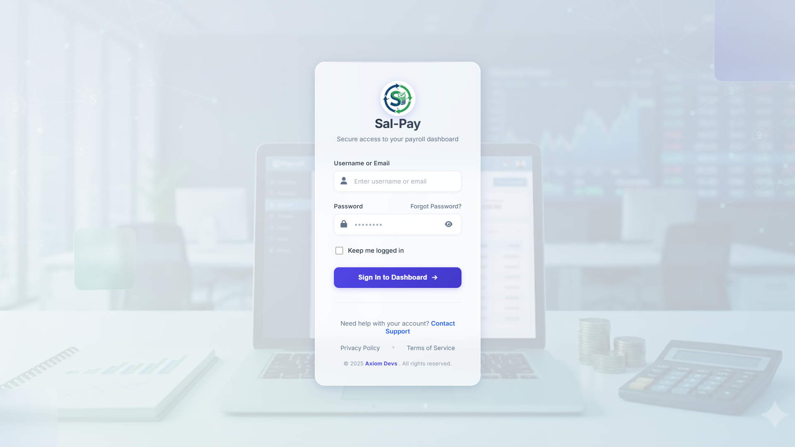
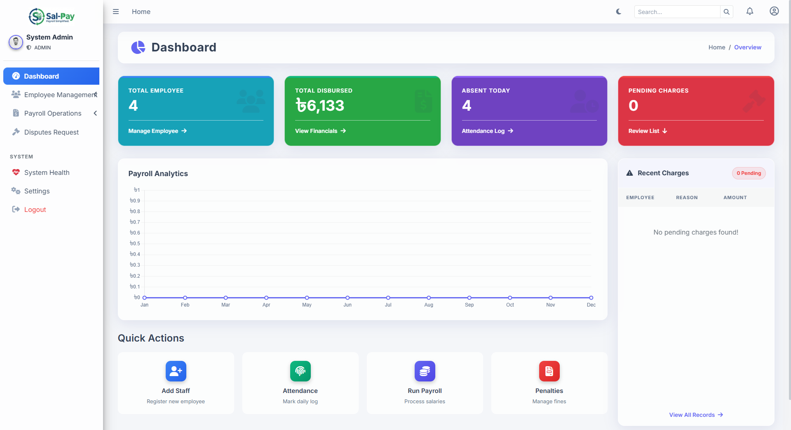
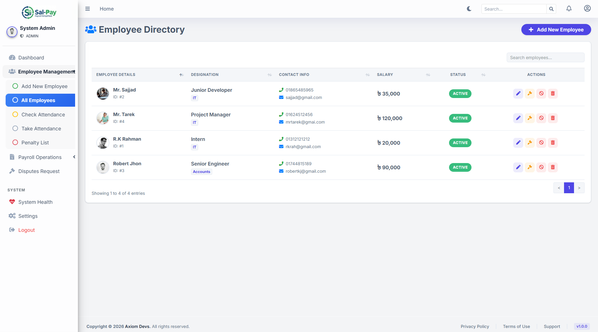
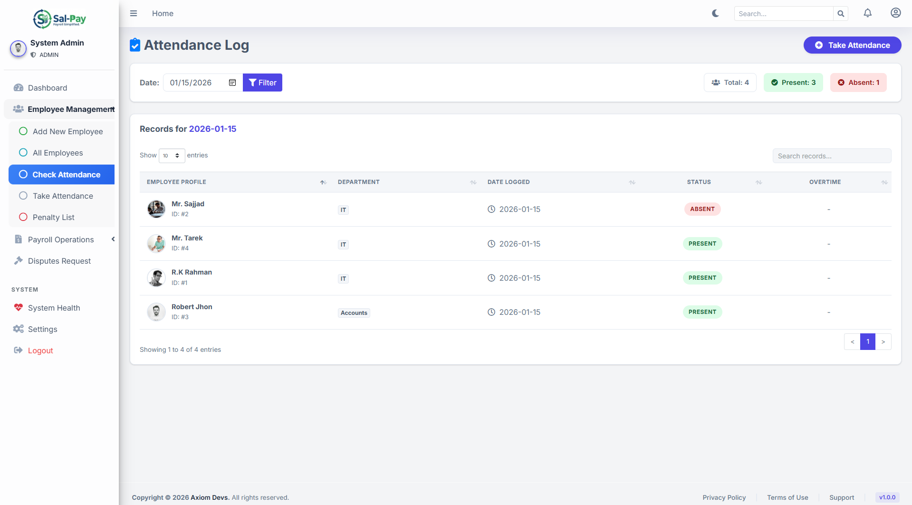
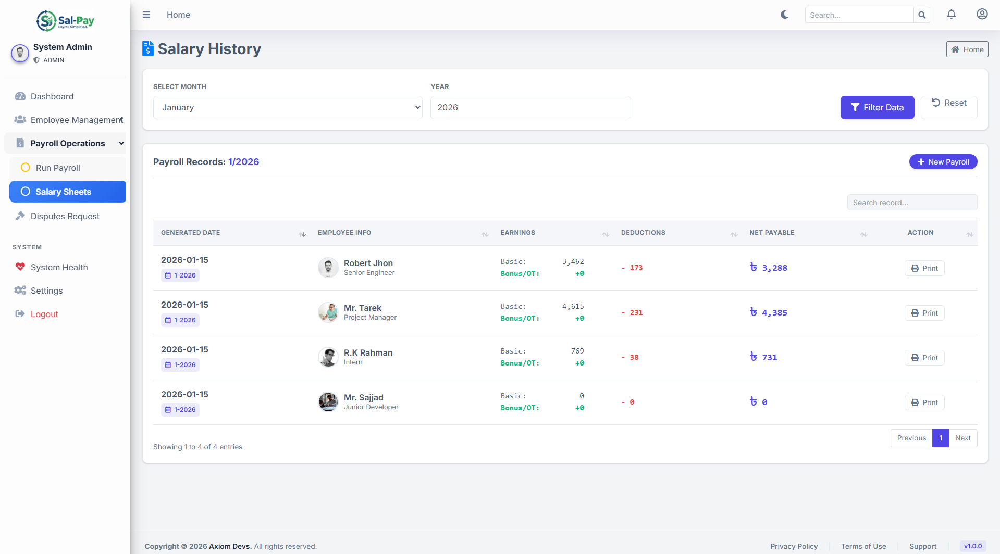
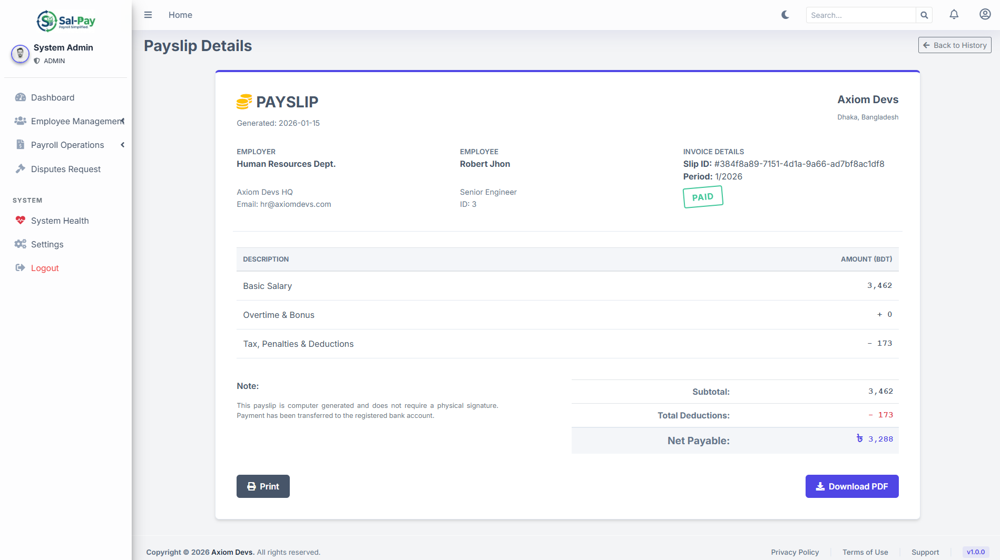
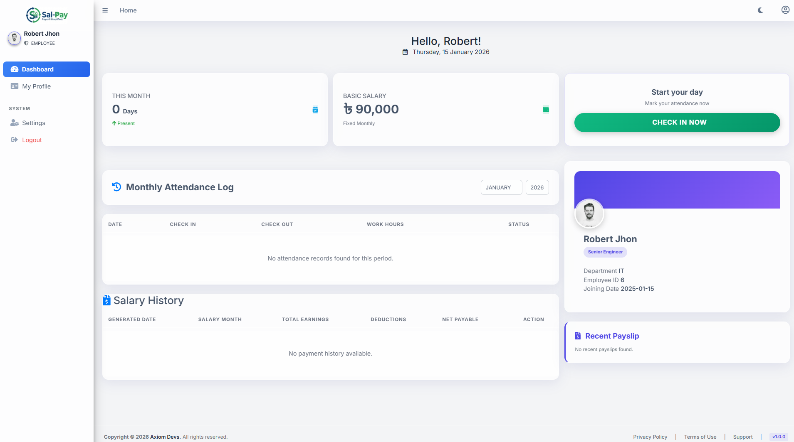
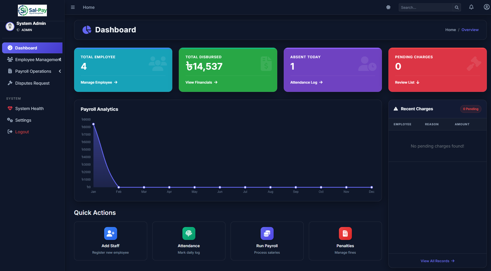

# Sal-Pay 💼

[](https://spring.io/projects/spring-boot)
[](https://www.oracle.com/java/)
[](https://www.postgresql.org/)
[](LICENSE)

**Sal-Pay** is a comprehensive Payroll Management System built with Spring Boot, designed to streamline employee management, attendance tracking, salary calculations, and payroll processing. With a clean, polymorphic architecture and modern UI, it offers an efficient solution for organizations to manage their workforce.

---

## 📸 Screenshots


### Login Page


### Dashboard Overview

*Real-time analytics, attendance overview, and payroll trends at a glance*

### Employee Management

*Complete employee directory with search, filter, and quick actions*

### Attendance Tracking

*Self-service check-in/check-out with IP validation and work hour tracking*

### Payroll Processing

*Automated monthly salary generation with detailed breakdowns*

### Payslip Generation

*Professional payslips with earnings, deductions, and net pay*

### Employee Portal

*Dedicated portal for employees to view attendance and payslips*

### Dark Dashboard Overview

*Real-time analytics, attendance overview, and payroll trends at a glance*
---

## 🚀 Features

### 👥 Employee Management
- Complete employee directory with profile management
- Role-based access control (Super Admin, Admin, Employee)
- Employee status management (Active, Suspended)
- Bulk operations and advanced search functionality
- Profile photo uploads with validation

### 📊 Attendance System
- **Self-Service Portal**: Employees can check in/check out
- **IP-Based Security**: Configurable IP whitelist for attendance marking
- **Automatic Calculations**: Work hours and overtime tracking
- **8-Hour Work Rule**: Automated present/absent status based on work duration
- **Dispute Management**: Employees can dispute absent records, admins can review
- **Manual Override**: Admin capability for attendance corrections

### 💰 Payroll Processing
- Automated monthly salary generation
- Dynamic salary calculations based on:
  - Base salary from designation
  - Attendance records
  - Overtime hours
  - Penalties/fines
- Detailed payslip generation with PDF support
- Historical salary tracking and reporting

### ⚖️ Penalty Management
- Charge sheet system for fines/penalties
- Status tracking (Pending, Deducted)
- Automatic deduction during payroll processing
- Complete penalty history

### 🔐 Security & Authentication
- Spring Security integration
- BCrypt password encryption
- Role-based authorization
- Password reset functionality via email
- Session management
- Custom login success handlers

### 📧 Email Notifications
- Password reset emails
- System notifications
- SMTP integration (Gmail)

### 📈 Dashboard & Analytics
- Real-time system health monitoring
- Monthly payroll trends
- Attendance statistics
- Pending tasks overview
- Interactive charts and visualizations

---

## 🛠️ Tech Stack

| Layer | Technology |
|-------|-----------|
| **Backend** | Spring Boot 3.5.7, Java 21 |
| **Security** | Spring Security 6 |
| **Database** | PostgreSQL |
| **ORM** | Spring Data JPA, Hibernate |
| **Template Engine** | Thymeleaf |
| **Build Tool** | Maven |
| **UI Framework** | Bootstrap 5, AdminLTE 3 |
| **Email** | Spring Mail (SMTP) |

---

## 📋 Prerequisites

Before you begin, ensure you have the following installed:

- **Java Development Kit (JDK) 21** or higher
- **PostgreSQL** 12+ (Database server)
- **Maven** 3.8+ (Build tool)
- **IDE**: IntelliJ IDEA or Visual Studio Code
- **Git** (Version control)

---

## 🔧 Installation & Setup

### 1️⃣ Clone the Repository

```bash
git clone https://github.com/jihadjp/sal-pay.git
cd sal-pay
```

### 2️⃣ Database Configuration

**Create PostgreSQL Database:**

```sql
CREATE DATABASE payroll;
```

**Update Database Credentials:**

Edit `src/main/resources/application.properties`:

```properties
spring.datasource.url=jdbc:postgresql://localhost:5432/payroll
spring.datasource.username=postgres
spring.datasource.password=your_password_here
```

### 3️⃣ Email Configuration (Optional)

For password reset functionality, configure your Gmail SMTP:

```properties
spring.mail.username=your_email@gmail.com
spring.mail.password=your_app_specific_password
```

> **Note**: Enable "Less secure app access" or use an App Password for Gmail.

### 4️⃣ IP Whitelist Configuration

Configure allowed IPs for attendance marking:

```properties
app.attendance.allowed-ips=127.0.0.1,0:0:0:0:0:0:0:1,192.168.0.105
```

---

## 🚀 Running the Application

### Option A: IntelliJ IDEA

1. **Import the Project**:
   - Open IntelliJ IDEA
   - Select `File` → `Open` → Navigate to project folder
   - Wait for Maven dependencies to download

2. **Configure Run Configuration**:
   - Click `Run` → `Edit Configurations`
   - Add new `Spring Boot` configuration
   - Main class: `com.jptechgenius.payroll.PayrollApplication`
   - Click `Apply` → `OK`

3. **Run the Application**:
   - Click the green `Run` button or press `Shift + F10`
   - Application will start on `http://localhost:9090`

### Option B: Visual Studio Code

1. **Install Extensions**:
   - Java Extension Pack
   - Spring Boot Extension Pack
   - Maven for Java

2. **Open Project**:
   - `File` → `Open Folder` → Select project directory

3. **Run Application**:
   ```bash
   ./mvnw spring-boot:run
   ```
   Or use the Spring Boot Dashboard in VS Code

### Option C: Command Line

```bash
# Clean and install dependencies
./mvnw clean install

# Run the application
./mvnw spring-boot:run
```

The application will be accessible at: **http://localhost:9090**

---

## 👤 Default Credentials

Upon first launch, the system creates default admin accounts:

| Username | Password | Role | Email |
|----------|----------|------|-------|
| `admin` | `1234` | ADMIN | admin@axiomdevs.com |
| `superadmin` | `1234` | SUPER_ADMIN | superadmin@axiomdevs.com |

> ⚠️ **Security Warning**: Change these passwords immediately after first login!

---

## 📁 Project Structure

```
sal-pay/
├── src/
│   ├── main/
│   │   ├── java/com/jptechgenius/payroll/
│   │   │   ├── config/           # Security, MVC, Data Seeder
│   │   │   ├── controller/       # REST & Web Controllers
│   │   │   ├── model/            # JPA Entities
│   │   │   ├── repository/       # Data Access Layer
│   │   │   ├── security/         # Custom Security Components
│   │   │   └── service/          # Business Logic Layer
│   │   └── resources/
│   │       ├── application.properties
│   │       ├── static/           # CSS, JS, Images
│   │       └── templates/        # Thymeleaf HTML Templates
│   └── test/                     # Unit & Integration Tests
├── user-photos/                  # Uploaded Profile Pictures
├── screenshots/                  # Application Screenshots
├── pom.xml                       # Maven Configuration
└── README.md
```

---

## 🎯 Key Workflows

### Employee Onboarding
1. Admin creates employee account with designation
2. System auto-generates credentials
3. Employee receives login credentials
4. Employee logs in and completes profile

### Daily Attendance
1. Employee checks in via self-service portal
2. System validates IP address
3. Records check-in time
4. Employee checks out at end of day
5. System calculates work hours and overtime
6. Applies 8-hour rule for present/absent status

### Monthly Payroll
1. Admin navigates to Payroll → Generate
2. Selects month and year
3. System processes:
   - Fetches base salary from designation
   - Calculates attendance-based deductions
   - Adds overtime pay
   - Deducts pending penalties
4. Generates payslips for all employees
5. Employees can view/download their payslips

---

## 🔐 Security Features

- **Password Encryption**: BCrypt hashing algorithm
- **CSRF Protection**: Enabled by default
- **Role-Based Access**: Three-tier permission system
- **Session Management**: Secure session handling
- **IP Whitelisting**: Attendance security
- **SQL Injection Prevention**: Parameterized queries via JPA

---

## 🐛 Troubleshooting

### Database Connection Error
```
Error: Connection refused
```
**Solution**: Ensure PostgreSQL is running and credentials are correct

### Port Already in Use
```
Error: Port 9090 is already in use
```
**Solution**: Change port in `application.properties`:
```properties
server.port=8080
```

### Email Not Sending
**Solution**: 
- Verify SMTP credentials
- Enable "Less secure apps" in Gmail
- Use App-Specific Password

---

## 🤝 Contributing

Contributions are welcome! Please follow these steps:

1. Fork the repository
2. Create a feature branch (`git checkout -b feature/AmazingFeature`)
3. Commit your changes (`git commit -m 'Add some AmazingFeature'`)
4. Push to the branch (`git push origin feature/AmazingFeature`)
5. Open a Pull Request

---

## 📝 License

This project is licensed under the MIT License - see the [LICENSE](LICENSE) file for details.

---

## 👨‍💻 Author

**Jihad**  
*Full Stack Developer*

- GitHub: [@jihadjp](https://github.com/jihadjp)
- Email: programmerjihad@gmail.com

---

## 🙏 Acknowledgments

- **Axiom Devs** - Development Team
- Spring Boot Community
- Bootstrap & AdminLTE Contributors
- All open-source contributors

---

## 📞 Support

For support, email **programmerjihad@gmail.com** or create an issue in this repository.

---

## ⭐ Show Your Support

If this project helped you, please give it a ⭐️ on GitHub!

---

<div align="center">
  <strong>Built with ❤️ using Spring Boot</strong>
  <br>
  <sub>Version 1.0.0 | © 2024 Axiom Devs</sub>
</div>
